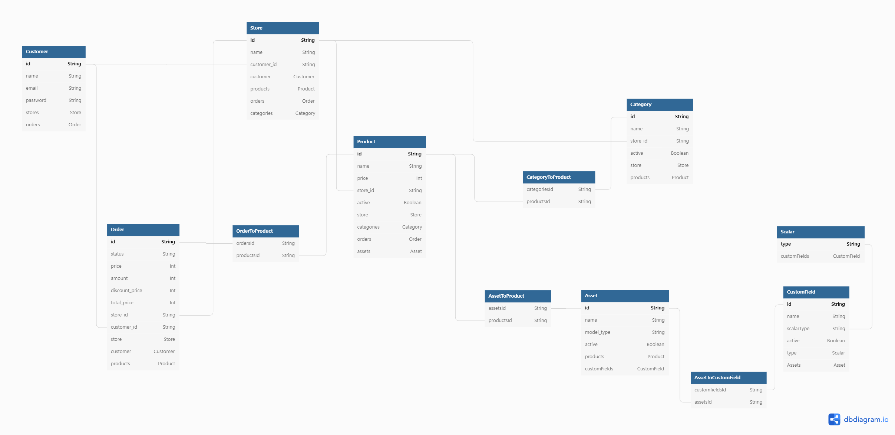

# ShoppingMall
## 1. Outline
### 1.1 Introduction
해당 레포지토리는 아래의 라이브러리를 이용한 Typescript 기반의 쇼핑몰 서버이다.
- [NestJS](https://nestjs.com) : A progressive Node.js framework
- [Prisma](https://www.prisma.io/) :  Next-generation Node.js and TypeScript ORM  

누구나 상점을 개설하고, 상품을 판매할 수 있는 ```e-commerce``` 서비스 이다.  
빠른 재현과, 번거로운 환경설정을 방지하기 위해, ```sqlite``` database를 예시로 작성하였다.  
이때문에 createMany, enum, json field 사용 불가능 등의 제약사항이 발생하였다.

해당 서비스의 시작은, ```yarn``` 을 통해 dependency를 설치하는것으로 시작된다.  
현재는 예제 database를 github에 첨부하였으나, 해당 DB를 지운 후 ```npx prisma migrate dev```를 실행하면 새 환경을 얻을 수 있다.  
새 환경을 얻은 이후, ```npx prisma generate```를 통하여 자바스크립트 Client를 얻을 수 있다.  
다만 API에 대한 설계가 목적이기에, 테스트가 부족할 수 있다.
이를 보완하기 위해, ```prisma studio``` 를 사용한다.  
```npx prisma studio``` 명령어를 통해, 콘솔에서 데이터에 대한 CRUD가 가능하다.

###  1.2 Goal
각 상점마다 자신이 소유한 데이터를 확장시킬 수 있는 **사용자 정의 필드** (이하 ```customField```) 기능을 구현하려고 한다.  
각 상점마다 원하는 모델 (상품,고객,주문)의 **사용자 정의 필드** 는 다를 수 있고, 이를 관리할 수 있어야 한다.


## 2. Structure

### 2.1 ERD

### 2.2 Before Structure
아래 데이터구조는 사전에 구조가 정의되어 있었던 것들이다.

- ```Customer``` (고객)
- ```Product``` (상품)
- ```Order``` (주문)

### 2.3 Ebodiment Structure
아래 데이터 구조는 사전 정의에 포함되어 있던 것을 구체화 시킨 것이다.
- ````Store```` (고객이 생성한 쇼핑몰)
- ````Category```` (쇼핑몰의 상품 분류)


### 2.4 Implement Structure
아래 데이터 구조는 customField를 위해 구현한 기능이다.

```Asset```
> ```CustomField```의 집합이다.  
> ```Asset```을 ```product```에 등록하는 것으로, 단독으로 동작하는 ```CustomField```를 묶어 모듈화 한다.  
> ```Delivery``` 등의 타입을 기본제공 할 것이다.  
> type을 통해 도메인별 (```Order``` ,```Product```, ```User```)로 구별된다.  

````CustomField````
> 실제로 유저가 사용하는 ```custom field```이다.  
> 해당 필드는, 상품에 직접 적용하는 것이 아닌, ```Asset```에 등록하는 구조이다.  
> 해당 타입의 동작은, 아래의 ```Scalar```타입에 의해 결정된다.

```Scalar```
> ```CustomField```에서 사용가능한 데이터 타입이다.  
> ```phone```, ```text```, ```address```, ```email```, ```number```, ```point```, ```select``` 의 타입을 지원하며, 추후에 새로운 타입을 추가할 수 있다.  
> 무한하게 데이터 타입을 열어줄 경우, 빌더상 문제가 발생할 가능성이 높아 제약사항을 두었다.

## 3 Use Case
유저는 아래와 같은 flow를 통해 쇼핑몰의 생성부터, 상품등록 등을 하게될 것이다.  
동작과 연관된 테이블은 괄호에 표시하겠다.
1. 회원가입을 한다 (```Customer```)
2. 쇼핑몰을 만든다. (```Store```, ```Customer```)
3. 상품을 생성한다. (```Product```)
4. 사용자 정의 필드를 생성한다. (```CustomField```)
5. 사용자 정의 필드를 합친 에셋을 생성한다. (```Asset```, ```CustomField```)
6. 에셋을 상품과 연결한다. (```Product```,```Asset```)
7. 카테고리를 생성한다. (```Category```)
8. 상품을 카테고리에 추가한다. (```Category```,```Product```)

## 4. API
### 4.1 ```Customer```
기본적으로 고객 인증은 jwt를 통하여 한다고 가정한다.  
경로에 id를 받지 않고, jwt상에 있는 id를 decode하여 사용한다.  
모든 삭제는 softDelete를 이용해 진행한다.
> Customer, Product , Order 에 대한 CRUD는 생략하고 진행하겠다.  


```GET /customers/stores```
- 고객의 모든 쇼핑몰을 가져온다.
- 전체 쇼핑몰의 통합 관리에 사용된다.  

```POST /customer/stores```
```ts
@Body: StoreName (스토어의 명칭)
@Return: Store (생성된 스토어를 반환)
```
- store를 생성하는 API
- 새로운 스토어를 만들거나, 첫 로그인시에 진행하게 된다.

```GET /customers/stores/:storeId```
```ts
@Param: storeId
@Return: Store (스토어의 상세정보 반환)
```
- 스토어 단건에 대한 상세정보 조회 API
- 여기서부터 product, asset등의 다양한 작업이 진행된다.

```Patch /customer/stores/:storeId```
```ts
@Param: storeId
@Body: StoreName (스토어의 명칭)
@Return: Store (수정된 스토어정보 반환)
```
- 스토어 이름만을 수정할 수 있는 API

```DELETE /customer/stores/:storeId```
```ts
@Param: storeId
```
- 스토어를 삭제할 수 있는 API
- 다만 해당 기능은 user가 아닌 admin에 탑재한 후, 문의를 통해 진행될 예정이다.

```GET /customers/stores/:storeId/products```
```ts
@Param: storeId
@Return: Products (등록된 상품정보 리스트 반환)
```
- 등록된 상품 목록을 가져오는 API
- 관리페이지, 혹은 유저가 보는 페이지에서도 사용 가능하다.

```POST /customers/stores/:storeId/products```
```ts
@Param: storeId
@Body: productName(상품명칭), price(상품 가격), categories[] (카테고리 리스트) assets[] (에셋 리스트)
@Return Product (생성된 상품정보)
```
- 상품을 생성하는 API
- restful 에는 조금 어긋나나, relation create 기능에 대해서도 고민중이다.  
ex) ```category```데이터 구조를 함께 생성 할 수 있는 relation create도 지원하는 스펙

```GET /customers/stores/:storeId/products/:productId```
```ts
@Param: storeId, productId
@Return Product (asset이 포함된 상세정보)
```
- 상품 상세 페이지이다.
- asset이 존재한다면, 이때 조회한다.


```PATCH /customers/stores/:storeId/products/:productId```
```ts
@Param: storeId, productId
@Body: productName(상품명칭), price(상품 가격), categories[] (카테고리 리스트) assets[] (에셋리스트)
@Return: Product (수정된 상품 반환)
```
- 상품을 수정하는 API다.
- 해당 상품이 속해있는 카테고리, asset을 변경할 수 있다.
- 가격 수정에 대해 조금 더 고민해봄직 하다.  ex)결제 대기 유저가 있다면 변경불가 등.


```DELETE /customers/stores/:storeId/products/:productId```
```ts
@Param: storeId, productId
```
- 스토어를 삭제할 수 있는 API

```GET /customers/stores/:storeId/customFields```
```ts
@Param: storeId
@Return: customFields (store의 customField리스트 반환)
```

```GET /customers/stores/:storeId/customFields/:customFieldId```
```ts
@Param: storeId, customFieldId
@Return: customFields (customField 상세정보 반환, asset포함)
```

```POST /customers/stores/:storeId/customFields/:customFieldId```
```ts
@Param: storeId, customFieldId
@Body: customFieldName, scalarType (허용 가능한 원시타입)
@Return: CustomField (수정된 CustomField 반환)
```
- 상품을 생성하는 API
- restful 에는 조금 어긋나나, relation create 기능에 대해서도 고민중이다.  
ex) ```customFieldId```데이터 구조를 함께 생성 할 수 있는 relation create도 지원하는 스펙


```PATCH /customers/stores/:storeId/customFields/:customFieldId```
```ts
@Param: storeId, customFieldId
@Body: customFieldName, scalarType (허용 가능한 원시타입), assets[] (수정할 asset리스트)
@Return: CustomField (수정된 CustomField 반환)
```
- customFieldId를 수정하는 API다.
- 해당 상품이 속해있는 type, asset도 같이 변경 가능하다.


```DELETE /customers/stores/:storeId/customFields/:customFieldId```
```ts
@Param: storeId customFieldId
```

```GET /customers/stores/:storeId/assets```
```ts
@Param: storeId
@Return: Assets (에셋 리스트 반환)
```

```GET /customers/stores/:storeId/assets/:assetId```
```ts
@Param: storeId, assetId
@Return: Asset (에셋 단건 상세 조회)
```

```POST /customers/stores/:storeId/assets/:assetId```
```ts
@Param: storeId, assetId
@Body: assetName, scalarType (허용 가능한 원시타입)
@Return: Asset (수정된 Asset 반환)
```
- Asset을 생성하는 API
- restful 에는 조금 어긋나나, relation create 기능에 대해서도 고민중이다.  
ex) ```customField```데이터 구조를 함께 생성 할 수 있는 relation create도 지원하는 스펙

```PATCH /customers/stores/:storeId/assets/:assetId```
```ts
@Param: storeId, assetId
@Body: name(에셋 이름), model_type(에셋의 모델타입) active(활성화 여부)
@Return: CustomField (수정된 CustomField 반환)
```
- asset을 수정하는 API다.

```DELETE /customers/stores/:storeId/assets/:assetId```
```ts
@Param: storeId assetId
```

```GET /customers/stores/:storeId/categories```
```ts
@Param: storeId
@Return: Categories (카테고리 리스트 반환)
```

```GET /customers/stores/:storeId/categories/categoryId```
```ts
@Param: storeId categoryId
@Return: Category (카테고리 상세정보 반환)
```

```POST /customers/stores/:storeId/categories/categoryId```
```ts
@Param: storeId, categoryId
@Body: assetName, active
@Return: Category (수정된 Category 반환)
```
- Category 생성하는 API```

```PATCH /customers/stores/:storeId/categories/categoryId```
```ts
@Param: storeId, assetId
@Body: customFieldName, scalarType (허용 가능한 원시타입), assets[] (수정할 asset리스트)
@Return: CustomField (수정된 CustomField 반환)
```
- assetId를 수정하는 API다.
- 해당 상품이 속해있는 type, asset도 같이 변경 가능하다.


```DELETE /customers/stores/:storeId/categories/categoryId```
```ts
@Param: storeId categoryId
```

```POST /order/check```
- 결제를 검증하는 API
- scalar타입을 검사할때 사용한다. (ex)배송날짜가 올바른타입인지 확인)

## 5. TODO
사용자 정의필드의 세분화
- validator를 통해, 지금보다 더 상세한 컨트롤이 가능하게 한다.
- 1유저당 1번만 구매가능 등의 기능  

GraphQL, Mongo관련
- 차수 (계층관계) 만 다른 같은 데이터를 계속 가져오고 있어, GraphQL을 도입해도 좋을 것 같다.
- 혹은 Mongo를 통한 No-SQL로 관리해도 괜찮을 듯 하나, 결제파트가 걸려 RDB로 진행했다.